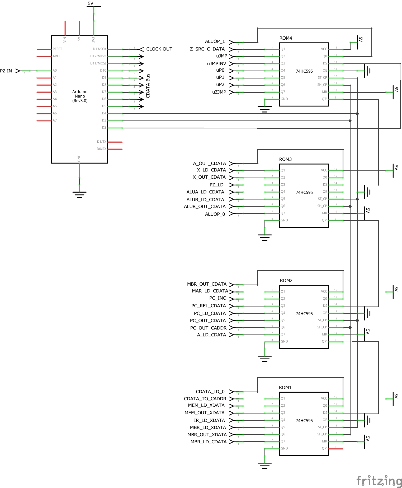

# Controller

A micro-controller based control unit and debugger for the [Diy CPU](https://github.com/skagra/diy-cpu).

# Functionality

* h => Print this help message.
* v => Toggle verbose mode.
* z => Toggle slow motion mode.
* x => Reset.
* r => Run.
* c => Continue.
* s => Single step.
* t => Test mode (continuous run)
* b [XX] => Set/clear breakpoint.
* d => Dump (report) state."

# Circuit

The circuit for the control unit is build around an Arduino (micro-controller) with the addition of four `74HC595` SIPO shift registers to extend the quantity of 
available outputs. 

Each of the shift registers is equivalent to one of the microcode ROMs in the control-unit-proper.

The schematic labels all control lines according to the key detailed below.

In addition, the micro-controller directly takes as input the value of `PZ` and outputs a clock signal used by the CPU and surrounding circuitry.

# Control Lines

## ROM 1

| Name             | Bit                                | Pin  | Description                                 |
| ---------------- | ---------------------------------- | ---- | ------------------------------------------- |
| `CDATA_LD_0`     | `00000000000000000000000000000001` | `QA` | Load 0 onto the `CDATA` bus.                |
| `CDATA_TO_CADDR` | `00000000000000000000000000000010` | `QB` | Connect the `CDATA` bus to the `CADDR` bus. |
| `MEM_LD_XDATA`   | `00000000000000000000000000000100` | `QC` | Load memory from the `XDATA` bus.           |
| `MEM_OUT_XDATA`  | `00000000000000000000000000001000` | `QD` | Write memory to the `XDATA` bus.            |
| `IR_LD_XDATA`    | `00000000000000000000000000010000` | `QE` | Load the `IR` from the `XDATA` bus.         |
| `MBR_LD_XDATA`   | `00000000000000000000000000100000` | `QF` | Load the `MBR` from the `XDATA` bus.        |
| `MBR_OUT_XDATA`  | `00000000000000000000000001000000` | `QG` | Write the `MBR` to the `XDATA` bus.         |
| `MBR_LD_CDATA`   | `00000000000000000000000010000000` | `QH` | Load the `MBR` from the `CDATA` bus.        |

## ROM 2

| Name            | Bit                                | Pin  | Description                                                                                 |
| --------------- | ---------------------------------- | ---- | ------------------------------------------------------------------------------------------- |
| `MBR_OUT_CDATA` | `00000000000000000000000100000000` | `QA` | Write the `MBR` onto the `CDATA` bus.                                                       |
| `MAR_LD_CADDR`  | `00000000000000000000001000000000` | `QB` | Load the `MAR` from the `CADDR` bus.                                                        |
| `PC_INC`        | `00000000000000000000010000000000` | `QC` | Increment the `PC`.                                                                         |
| `PC_REL_CDATA`  | `00000000000000000000100000000000` | `QD` | Signed addition of contents of the `CDATA` bus to the `PC`, storing the result in the `PC`. |
| `PC_LD_CDATA`   | `00000000000000000001000000000000` | `QE` | Load the `PC` from the `CDATA` bus.                                                         |
| `PC_OUT_CDATA`  | `00000000000000000010000000000000` | `QF` | *Not used*                                                                                  |
| `PC_OUT_CADDR`  | `00000000000000000100000000000000` | `QG` | Write the `PC` to the `CADDR` bus.                                                          |
| `A_LD_CDATA`    | `00000000000000001000000000000000` | `QH` | Load `A` from the `CDATA` bus.                                                              |

## ROM 3

| Name             | Bit                                | Pin  | Description                                  |
| ---------------- | ---------------------------------- | ---- | -------------------------------------------- |
| `A_OUT_CDATA`    | `00000000000000010000000000000000` | `QA` | Write `A` to the `CDATA` bus.                |
| `X_LD_CDATA`     | `00000000000000100000000000000000` | `QB` | Load `X` from the `CDATA` bus.               |
| `X_OUT_CDATA`    | `00000000000001000000000000000000` | `QC` | Write `X` to the `CDATA` bus.                |
| `PZ_LD`          | `00000000000010000000000000000000` | `QD` | Load `PZ`.                                   |
| `ALUA_LD_CDATA`  | `00000000000100000000000000000000` | `QE` | Load `ALUA` from the `CDATA` bus.            |
| `ALUB_LD_CDATA`  | `00000000001000000000000000000000` | `QF` | Load `ALUB` from the `CDATA` bus.            |
| `ALUR_OUT_CDATA` | `00000000010000000000000000000000` | `QG` | Write the `ALU` output onto the `CDATA` bus. |
| `ALUOP_0`        | `00000000100000000000000000000000` | `QH` | `ALU` operation bit 0.                       |

## ROM 4

| Name          | Bit                                | Pin  | Description                                                                                                                   |
| ------------- | ---------------------------------- | ---- | ----------------------------------------------------------------------------------------------------------------------------- |
| `ALUOP_1`     | `00000001000000000000000000000000` | `QA` | `ALU` operation bit 1.                                                                                                        |
| `Z_SRC_CDATA` | `00000010000000000000000000000000` | `QB` | Take source for `PZ` from the `CDATA` bus if high, from the `ALU` if low (`PZ_LD` must be set to to actually load the value). |
| `uJMP`        | `00000100000000000000000000000000` | `QC` | Flags a microcode unconditional jump.                                                                                         |
| `uJMPINV`     | `00001000000000000000000000000000` | `QD` | Inverts the logic for a microcode conditional jump.                                                                           |
| `uP0`         | `00010000000000000000000000000000` | `QE` | Continue at microcode P0 entry point.                                                                                         |
| `uP1`         | `00100000000000000000000000000000` | `QF` | Continue at microcode P1 entry point (based on address mode decoded from machine code).                                       |
| `uP2`         | `01000000000000000000000000000000` | `QG` | Continue at microcode P2 entry point (based on operation decoded from machine code).                                          |
| `uZJMP`       | `10000000000000000000000000000000` | `QH` | Conditional microcode jump based on the `Z` value supplied to the control unit and the `uJMPINV` flag.                        |

# Glossary

| Symbol  | Description                                 |
| ------- | ------------------------------------------- |
| `A`     | Accumulator.                                |
| `CADDR` | CPU's internal address bus.                 |
| `CDATA` | CPU's internal data bus.                    |
| `ALU`   | Arithmetic Logic Unit.                      |
| `IR`    | Instruction Register.                       |
| `MBR`   | Memory Buffer Register.                     |
| `MEM`   | Memory (RAM/ROM/Memory mapped I/O).         |
| `PC`    | Program Counter.                            |
| `PZ`    | Zero flag in the processor status register. |
| `X`     | X general purpose register.                 |
| `XADDR` | External (to the CPU) address bus.          |
| `XDATA` | External (to the CPU) data bus.             |

